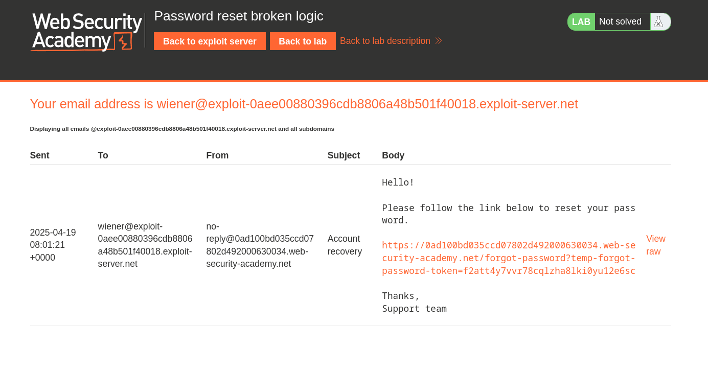
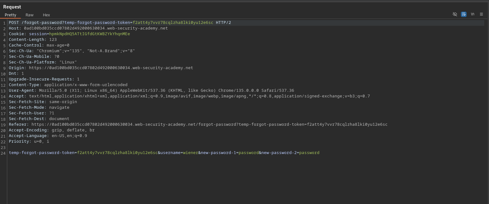

# Password reset broken logic

**Lab Url**: [https://portswigger.net/web-security/authentication/other-mechanisms/lab-password-reset-broken-logic](https://portswigger.net/web-security/authentication/other-mechanisms/lab-password-reset-broken-logic)

## Objective

This lab's password reset functionality is vulnerable. To solve the lab, reset Carlos's password then log in and access his "My account" page.

- Your credentials: `wiener:peter`
- Victim's username: `carlos`

## Solution

The password reset flow is broken: the reset token is emailed and validated correctly, but the server trusts the `username` parameter in the final POST request instead of deriving it from the token. This means we can use Wiener's valid reset link but change the username to Carlos — the server resets Carlos's password instead.

### Step 1: Request a password reset for Wiener

Navigate to `/forgot-password` and submit Wiener's username. An email with a reset link is sent to Wiener's email client.



### Step 2: Retrieve the reset link

Open the lab's email client and find the password reset email. It contains a link like:

```bash
https://LAB-ID.web-security-academy.net/forgot-password?temp-forgot-password-token=TOKEN
```

Click through to the reset page.

### Step 3: Intercept and modify the request

On the reset page, enter a new password of your choice. Before submitting, intercept the POST request in Burp.

The request looks like this:

```bash
POST /forgot-password?temp-forgot-password-token=YOUR-TOKEN HTTP/1.1
...
username=wiener&new-password-1=YOUR_PASS&new-password-2=YOUR_PASS
```



Change the `username` parameter from `wiener` to `carlos`:

```bash
username=carlos&new-password-1=YOUR_PASS&new-password-2=YOUR_PASS
```

Forward the request.

### Step 4: Log in as Carlos

Go to `/login` and sign in with `carlos` and the password you just set. The lab is solved.
