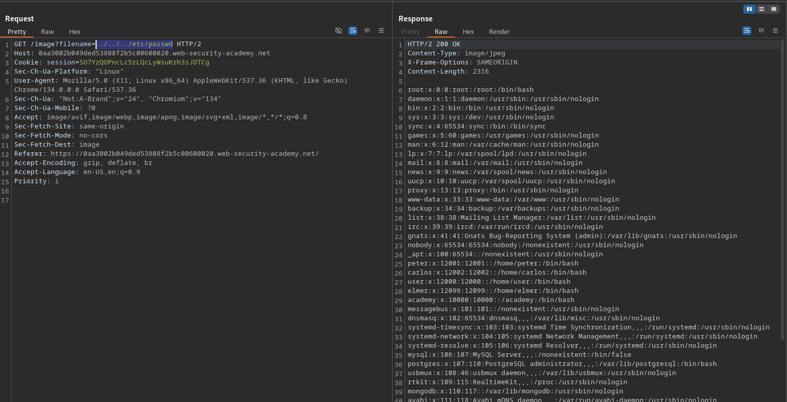

# File path traversal, simple case

**Lab Url**: [https://portswigger.net/web-security/file-path-traversal/lab-simple](https://portswigger.net/web-security/file-path-traversal/lab-simple)

## Objective

This lab contains a path traversal vulnerability in the display of product images.

To solve the lab, retrieve the contents of the `/etc/passwd` file.

## Solution

The application loads product images via a `filename` parameter in the URL, e.g., `/image?filename=01.jpg`. This parameter is vulnerable to path traversal.

### Step 1: Confirm the vulnerability

Try an absolute path to a system file:

```bash
/image?filename=/etc/passwd
```

A **400 Bad Request** is returned, suggesting absolute paths are blocked.

### Step 2: Traverse with relative path

Use relative path traversal to navigate up the directory structure:

```bash
/image?filename=../../../etc/passwd
```

The server returns the contents of `/etc/passwd`, solving the lab.


