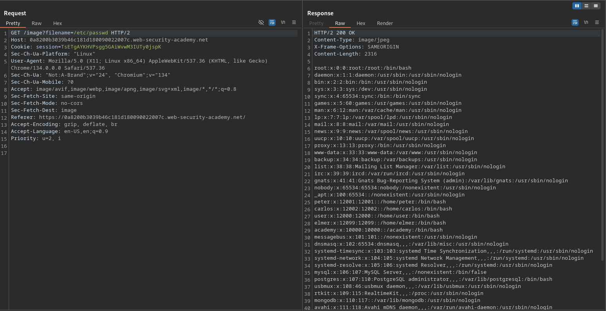

# File path traversal, traversal sequences blocked with absolute path bypass

**Lab Url**: [https://portswigger.net/web-security/file-path-traversal/lab-absolute-path-bypass](https://portswigger.net/web-security/file-path-traversal/lab-absolute-path-bypass)

## Objective

This lab contains a path traversal vulnerability in the display of product images.

The application blocks traversal sequences but treats the supplied filename as being relative to a default working directory.

To solve the lab, retrieve the contents of the `/etc/passwd` file.

## Solution

The application loads product images via a `filename` parameter, e.g., `/image?filename=01.jpg`. The server blocks relative traversal sequences (`../`) but does accept absolute paths, allowing a direct bypass.

### Step 1: Confirm absolute paths are accepted

Request a system file using its absolute path:

```bash
/image?filename=/etc/passwd
```

The server returns the contents of `/etc/passwd`, solving the lab.


