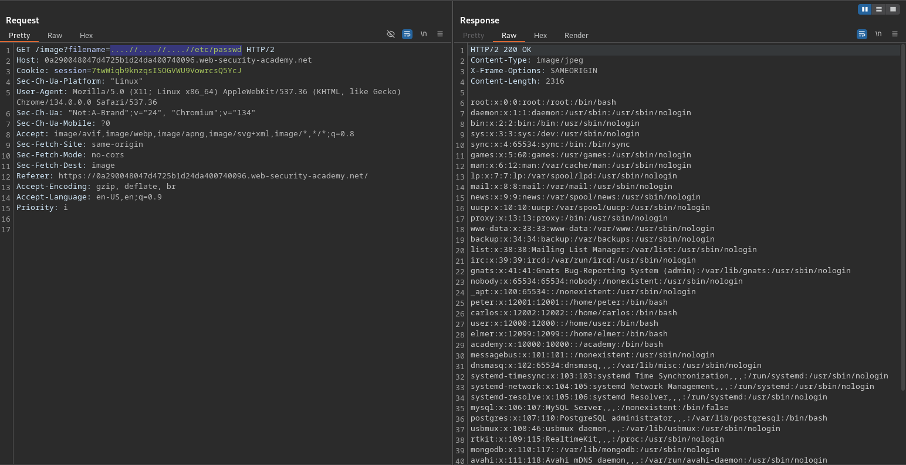

# File path traversal, traversal sequences stripped non-recursively

**Lab Url**: [https://portswigger.net/web-security/file-path-traversal/lab-sequences-stripped-non-recursively](https://portswigger.net/web-security/file-path-traversal/lab-sequences-stripped-non-recursively)

## Objective

This lab contains a path traversal vulnerability in the display of product images.

The application strips path traversal sequences from the user-supplied filename before using it.

To solve the lab, retrieve the contents of the `/etc/passwd` file.

## Solution

The application strips `../` from the filename before processing it. A simple payload like `../etc/passwd` becomes `etc/passwd` after the removal — no traversal occurs.

However, the stripping is performed only once (non-recursively). We can craft a payload where removing `../` once leaves behind a new traversal sequence:

```text
Payload:      ....//....//....//etc/passwd
After strip:  ../../../etc/passwd
```

The inner `..` is stripped from each `....//`, turning it into `../`.

### Step 1: Send the bypass payload

```bash
/image?filename=....//....//....//etc/passwd
```

The server returns the contents of `/etc/passwd`, solving the lab.


