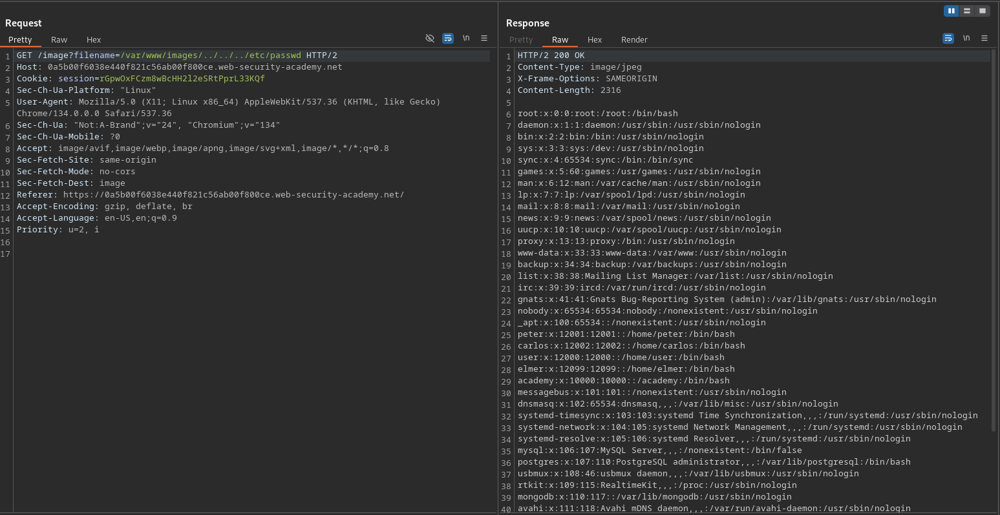

# File path traversal, validation of start of path

**Lab Url**: [https://portswigger.net/web-security/file-path-traversal/lab-validate-start-of-path](https://portswigger.net/web-security/file-path-traversal/lab-validate-start-of-path)

## Objective

This lab contains a path traversal vulnerability in the display of product images.

The application transmits the full file path via a request parameter, and validates that the supplied path starts with the expected folder.

To solve the lab, retrieve the contents of the `/etc/passwd` file.

## Solution

The application validates that the file path starts with `/var/www/images`, so neither a direct absolute path (`/etc/passwd`) nor a relative path (`../../../etc/passwd`) works on its own.

We can bypass the check by prepending the required prefix and then using `../` sequences to traverse back out:

```bash
/var/www/images/../../../etc/passwd
```

The server confirms the path starts with `/var/www/images`, then resolves the `../` sequences to reach `/etc/passwd`.

### Step 1: Send the prefixed payload

```bash
/image?filename=/var/www/images/../../../etc/passwd
```

The server returns the contents of `/etc/passwd`, solving the lab.


