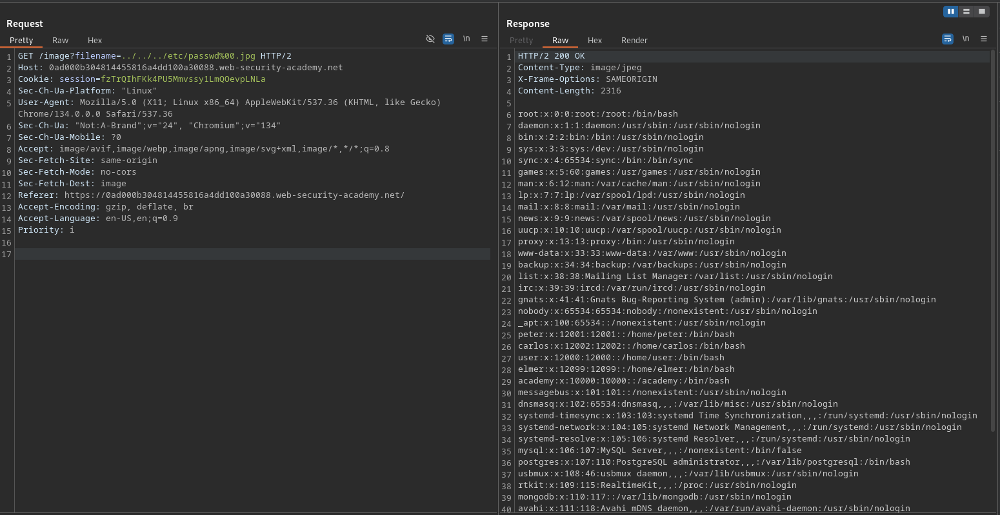

# File path traversal, validation of file extension with null byte bypass

**Lab Url**: [https://portswigger.net/web-security/file-path-traversal/lab-validate-file-extension-null-byte-bypass](https://portswigger.net/web-security/file-path-traversal/lab-validate-file-extension-null-byte-bypass)

## Objective

This lab contains a path traversal vulnerability in the display of product images.

The application validates that the supplied filename ends with the expected file extension.

To solve the lab, retrieve the contents of the `/etc/passwd` file.

## Solution

The application only serves files with a valid image extension. A simple path traversal like `../../../etc/passwd` is rejected because the filename doesn't end with `.jpg` or `.png`.

We can bypass this by appending a null byte (`%00`) followed by a valid extension. In vulnerable backends (e.g., C/C++), the null byte terminates the string — the extension check passes, but the file system reads only the path before the null:

```bash
../../../etc/passwd%00.jpg
```

The application sees `.jpg` at the end and allows the request. The underlying system sees `../../../etc/passwd` and serves the target file.

### Step 1: Send the null-byte payload

```bash
/image?filename=../../../etc/passwd%00.jpg
```

The server returns the contents of `/etc/passwd`, solving the lab.


