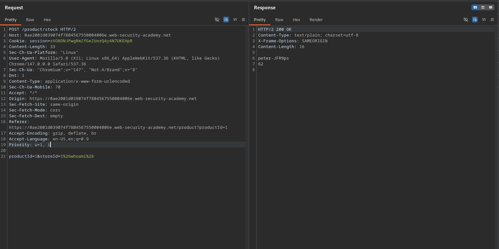

# OS command injection, simple case

**Lab Url**: [https://portswigger.net/web-security/os-command-injection/lab-simple](https://portswigger.net/web-security/os-command-injection/lab-simple)

## Objective

This lab contains an OS command injection vulnerability in the product stock checker.

The application executes a shell command containing user-supplied product and store IDs, and returns the raw output from the command in its response.

To solve the lab, execute the `whoami` command to determine the name of the current user.

## Solution

The product stock checker accepts a `productId` and `storeId` via POST request and runs a shell command with these values. The raw output is returned in the response, making command injection straightforward.

### Step 1: Inject a command

The `storeId` parameter is passed unsanitised into a shell command. Inject a command separator followed by `whoami`:

```bash
POST /product/stock
...
productId=1&storeId=1%26whoami%26
```

`%26` is the URL-encoded form of `&`, which acts as a command separator in shell. The server executes `whoami` and includes its output in the response.

The response reveals the current username, solving the lab.


