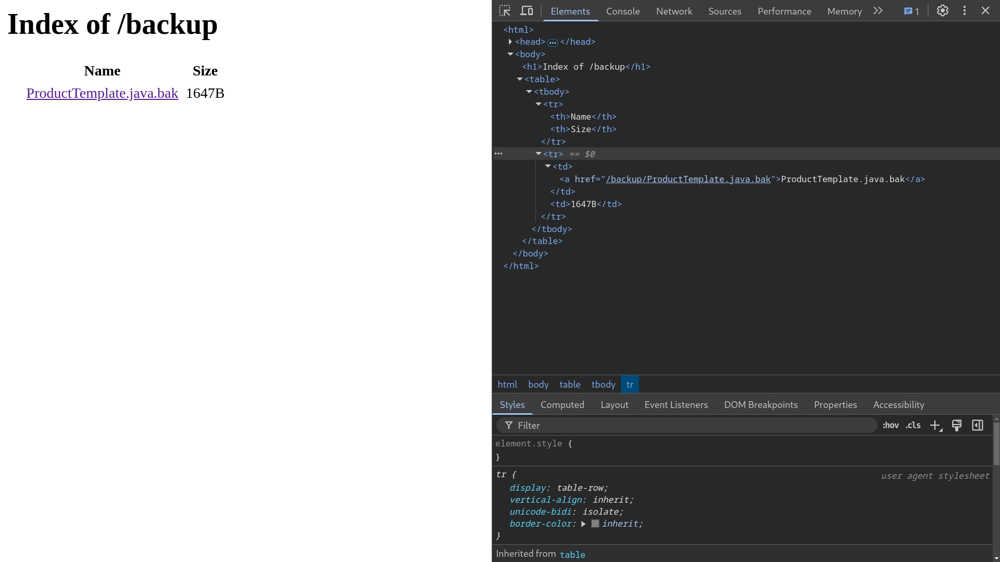
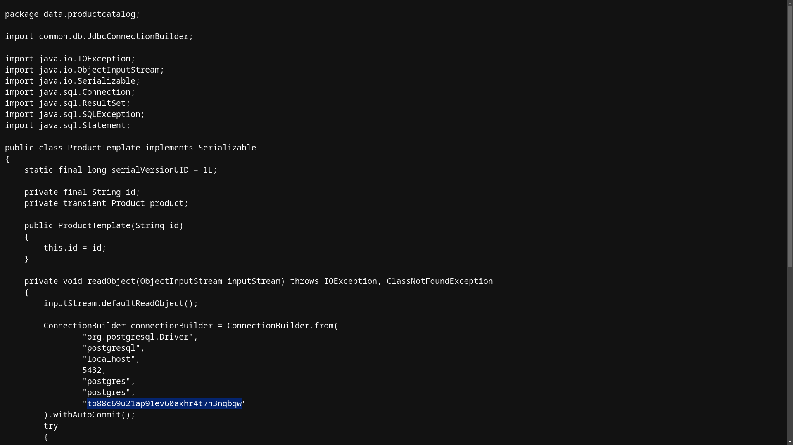

# Source code disclosure via backup files

**Lab Url**: [https://portswigger.net/web-security/information-disclosure/exploiting/lab-infoleak-via-backup-files](https://portswigger.net/web-security/information-disclosure/exploiting/lab-infoleak-via-backup-files)

## Objective

This lab leaks its source code via backup files in a hidden directory. To solve the lab, identify and submit the database password, which is hard-coded in the leaked source code.

## Solution

The application exposes a `robots.txt` file that reveals a hidden backup directory. This directory contains a backup of the source code with hard-coded credentials.

### Step 1: Check robots.txt

```bash
GET /robots.txt
```

The response shows:

```bash
User-agent: *
Disallow: /backup
```

### Step 2: Browse the backup directory

Navigate to `/backup` to find a backup file: `ProductTemplate.java.bak`.



### Step 3: Read the source code

Open `ProductTemplate.java.bak`. The source code reveals a hard-coded **Postgres database password**. Submit this password to solve the lab.


