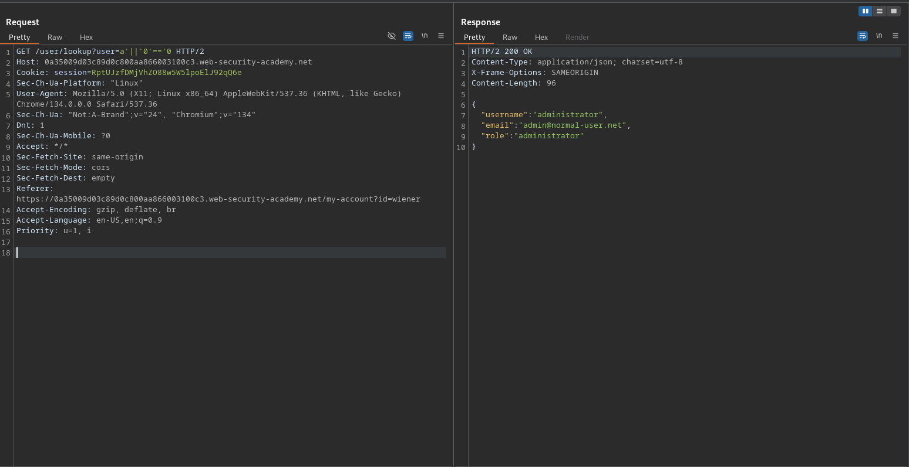

# Exploiting NoSQL injection to extract data

**Lab Url**: [https://portswigger.net/web-security/nosql-injection/lab-nosql-injection-extract-data](https://portswigger.net/web-security/nosql-injection/lab-nosql-injection-extract-data)

## Objective

The user lookup functionality for this lab is powered by a MongoDB NoSQL database. It is vulnerable to NoSQL injection.

To solve the lab, extract the password for the `administrator` user, then log in to their account.

You can log in to your own account using the following credentials: `wiener:peter`.

## Solution

The user lookup endpoint (`/user/lookup?user=wiener`) passes the username directly into a MongoDB query that supports JavaScript expressions. We can exploit this to extract data character by character.

### Step 1: Confirm injection

Append an apostrophe to the username:

```bash
/user/lookup?user=administrator'
```

The response returns an error, confirming broken query syntax.

### Step 2: Force a true condition

Inject a JavaScript condition that always evaluates to true:

```bash
/user/lookup?user=administrator'||'0'=='0
```

The query returns the first user in the database — the administrator — confirming JavaScript is being evaluated.



### Step 3: Determine password length

The boolean condition `this.password.length == N` returns a result only when N matches the actual length. Fuzz the numeric value:

```bash
/user/lookup?user=administrator'%26%26this.password.length=='FUZZ
```

When the response returns the user details instead of "Could not find user", the length is correct.

### Step 4: Extract the password character by character

Use the boolean condition `this.password[N] == 'C'` to guess each character at index N. Fuzz both the character value and the index:

```bash
/user/lookup?user=administrator'%26%26this.password[0]=='a
/user/lookup?user=administrator'%26%26this.password[1]=='d
...
```

Each successful match returns the user details; a mismatch returns "Could not find user". Reconstruct the full password from the matched characters.

### Step 5: Login

Log in as `administrator` with the extracted password to solve the lab.
