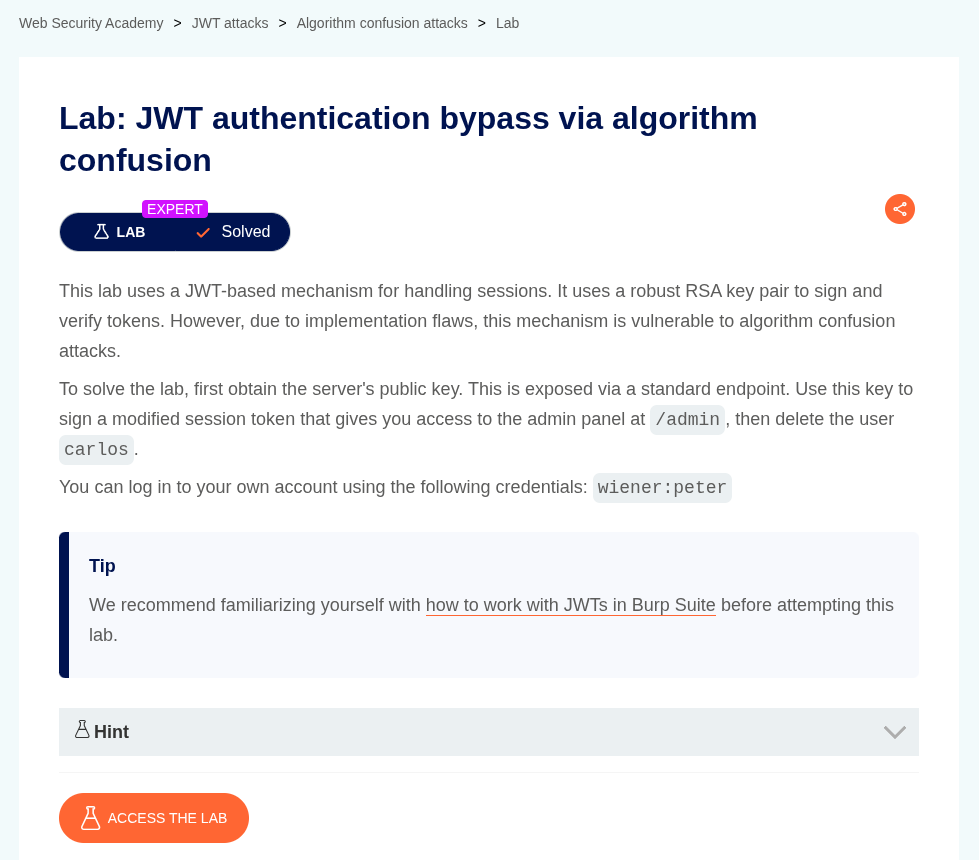
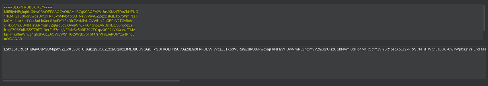
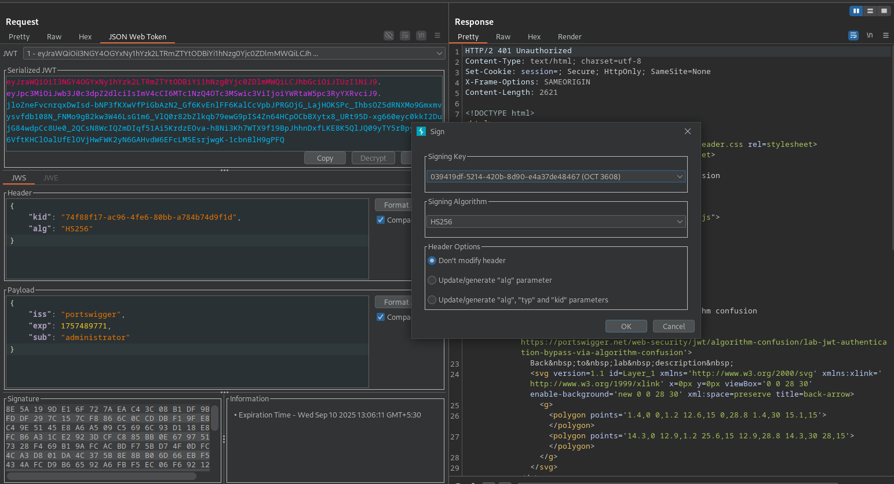
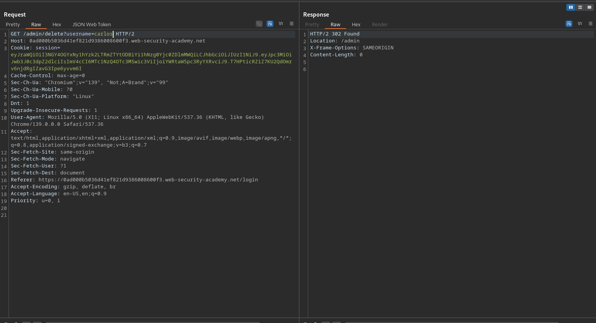

# JWT authentication bypass via algorithm confusion

**Lab Url**: [https://portswigger.net/web-security/jwt/algorithm-confusion/lab-jwt-authentication-bypass-via-algorithm-confusion](https://portswigger.net/web-security/jwt/algorithm-confusion/lab-jwt-authentication-bypass-via-algorithm-confusion)



## Objective

This lab uses a JWT-based mechanism for handling sessions. It uses a robust RSA key pair to sign and verify tokens. However, due to implementation flaws, this mechanism is vulnerable to algorithm confusion attacks.

To solve the lab, first obtain the server's public key. This is exposed via a standard endpoint. Use this key to sign a modified session token that gives you access to the admin panel at `/admin`, then delete the user `carlos`.

## What is a JWT algorithm confusion attack?

A JWT (JSON Web Token) Algorithm Confusion Attack is a type of vulnerability that exploits incorrect handling of the alg (algorithm) field in a JWT by a server during token verification.

**How JWT Works (Briefly):**

A JWT typically consists of three parts:
`Header`.`Payload`.`Signature`

- The header specifies the algorithm used to sign the token (e.g., HS256 for HMAC or RS256 for RSA).
- The payload contains the claims (user data).
- The signature verifies that the token was not tampered with.

**What the Attack Is:**

In an algorithm confusion attack, an attacker takes advantage of the server trusting the algorithm specified in the token's header without proper validation.

**Example Scenario:**

1. The server expects JWTs signed with a public/private key algorithm like RS256 (RSA).
2. The attacker changes the alg field in the header to HS256 (a symmetric algorithm that uses a shared secret).
3. The attacker then uses the server's public key (which is usually publicly available) as the shared secret to sign a forged token.
4. If the server blindly trusts the alg field and uses HS256, it will verify the token using the public key as a secret — and accept the forged token as valid.

## Solution

After logging in to your account, notice that the JWT token uses the **RS256** algorithm, which is an asymmetric algorithm. This means that a private key is used to sign the JWT, and a public key is used to verify the signature.

To perform an algorithm confusion attack, we need to retrieve the public key. After some fuzzing, the public key was found on `/jwks.json`.

```json
{
  "keys": [
    {
      "kty": "RSA",
      "e": "AQAB",
      "use": "sig",
      "kid": "74f88f17-ac96-4fe6-80bb-a784b74d9f1d",
      "alg": "RS256",
      "n": "2VUosfKMztTDnCbHEIzG1j1Q4R2Tu06dnJwqaUvCx-R-3PhMVb4tx83TNsV7V_wGZZqzDslQEik57SXmIN2TM0Mjtkmrz1-tYc48oLlx0nctUpd3YYE43fcZAvMlvUCjvWUhj2qGB0zV2TGvRx__cjikD5f7nJ6UvtNTrvuPmlm8ZgQic5qSjOwnWhLk7i64gnoEVPDs4Ep_S6np6zLeh-gF7C6_3dNS5_T7hET19erFc57mkjVFRdeSe5hRP39CE0xpz0CP2zVXXceU_ZMAbp-r4iufheWnv3i1g63fyCbZAOWSWS146cSWBx7oT6M7r_VFiIE_ePUbYzu4RhgLuQ"
    }
  ]
}
```

**Generate a malicious signing key:**

1. In Burp, go to the **JWT Editor Keys** tab in Burp's main tab bar.
2. Click **New RSA Key**.
3. In the dialog, make sure that the **JWK** option is selected, then paste the JWK that you just copied. Click OK to save the key.
4. Right-click on the entry for the key that you just created, then select **Copy Public Key as PEM**.
5. Use the Decoder tab to `Base64` encode this PEM key, then copy the resulting string.
   
6. Go back to the **JWT Editor Keys** tab in Burp's main tab bar.
7. Click New Symmetric Key. In the dialog, click Generate to generate a new key in JWK format. Note that you don't need to select a key size as this will automatically be updated later.
8. Replace the generated value for the `k` property with a Base64-encoded PEM that you just created.
9. Save the key.

Now, to access the admin panel at `/admin`, modify the `sub` parameter to `administrator` and `alg` parameter to `HS256` in JSON Web token. Now, sign the key with the symmetric key that you have generated. You should be able to access the admin panel. Delete the user `carlos` to solve the lab.






