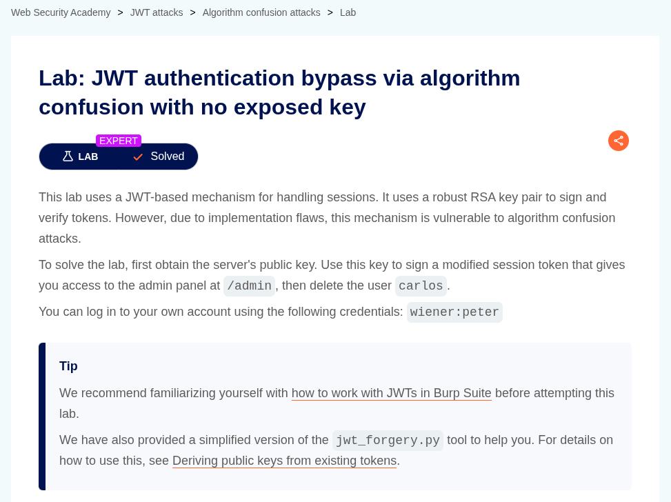
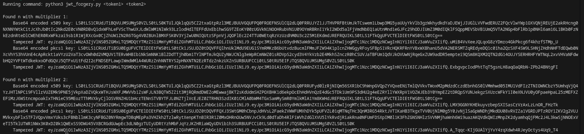
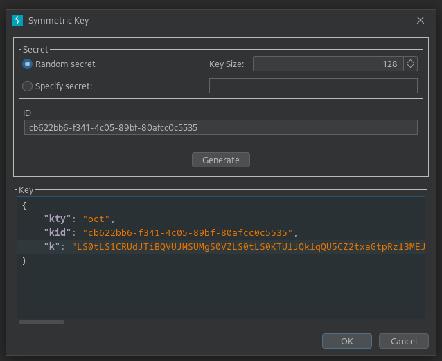
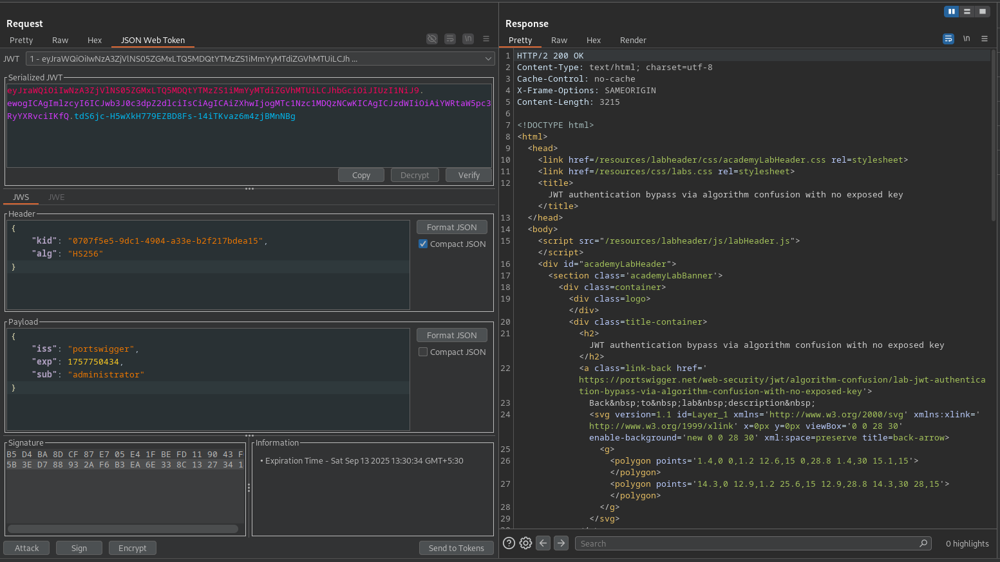

# JWT authentication bypass via algorithm confusion with no exposed key

**Lab Url**: [https://portswigger.net/web-security/jwt/algorithm-confusion/lab-jwt-authentication-bypass-via-algorithm-confusion-with-no-exposed-key](https://portswigger.net/web-security/jwt/algorithm-confusion/lab-jwt-authentication-bypass-via-algorithm-confusion-with-no-exposed-key)



## Objective

This lab uses a JWT-based mechanism for handling sessions. It uses a robust RSA key pair to sign and verify tokens. However, due to implementation flaws, this mechanism is vulnerable to algorithm confusion attacks.

To solve the lab, first obtain the server's public key. Use this key to sign a modified session token that gives you access to the admin panel at `/admin`, then delete the user `carlos`.

## Solution

After logging in to your account, copy the JWT token and save it, then log out. Now, log in again and copy the JWT token and save it as well.

Now that you have two valid tokens, run the following command to calculate one or more values of **`n`**.

```bash
docker run --rm -it portswigger/sig2n <token1> <token2>
```

Each of these is mathematically possible, but only one of them matches the value used by the server. In each case, the output also provides the following:

- A Base64-encoded public key in both X.509 and PKCS1 format.
- A tampered JWT signed with each of these keys.



Copy the tampered JWT and replace the session cookie with the tampered JWT, and try to access the My account page at `/my-account`.

- If you receive a `200` response and successfully access your account page, then this is the correct X.509 key.
- If you receive a `302` response that redirects you to `/login` and strips your session cookie, then this was the wrong X.509 key. In this case, repeat this step using the tampered JWT for each X.509 key that was output by the script.

**Generate a malicious signing key:**

1. From your terminal window, copy the Base64-encoded X.509 key that you identified as being correct in the previous section. Note that you need to select the key, not the tampered JWT that you used in the previous section.
2. In Burp, go to the **JWT Editor Keys** tab and click **New Symmetric Key**.
3. In the dialog, click **Generate** to generate a new key in JWK format.
4. Replace the generated value for the `k` property with a Base64-encoded key that you just copied. Note that this should be the actual key, not the tampered JWT that you used in the previous section.



**Delete Carlos Account:**

1. Go back to your request in Burp Repeater and change the path to `/admin`.
2. In the header of the JWT, make sure that the `alg` parameter is set to `HS256`
3. In the JWT payload, change the value of the `sub` claim to `administrator`.
4. At the bottom of the tab, click **Sign**, then select the symmetric key that you generated in the previous section.
5. Send the request and observe that you have successfully accessed the admin panel.
6. Now delete the user `carlos` to solve the lab.




